# ATCND

**Adaptive Topic and Cluster Number Determination** via Structured Search over Sliding Ranges

[](https://pypi.org/project/atcnd/)
[](https://pypi.org/project/atcnd/)
[](LICENSE)
[](tests/)

ATCND is a model-agnostic framework that determines the optimal number of topics (for LDA/NMF) or clusters (for K-Means) by treating K selection as a structured search problem over a user-specified integer range. Prior to ATCND, no model-agnostic method with correct K\* achieved sub-linear evaluation count: exhaustive grid search (the SOTA baseline in the model-agnostic + exact-K class) requires O(K_max − K_min) model evaluations. ATCND applies eight search strategies to achieve O(log(K_max − K_min)) evaluations — 59–79% fewer than grid search while matching its K\* accuracy.

## 8-Strategy Comparison

<p align="center">
  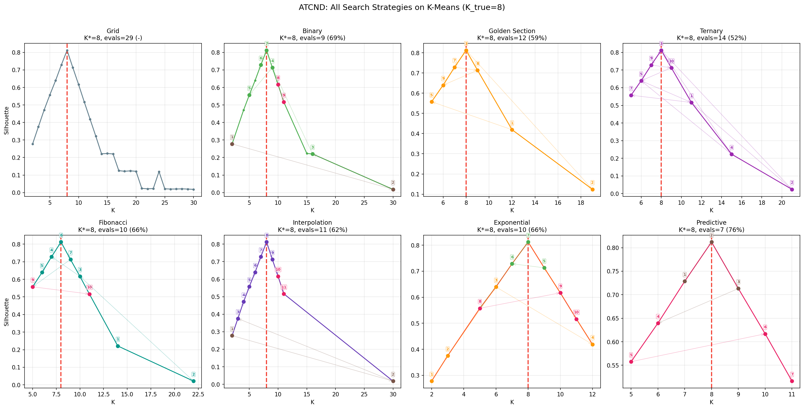
</p>

Benchmark on K-Means (SyntheticBlobs, K\_true=8, range [2,30]):

| Strategy | Complexity | Evals | vs Grid |
|----------|-----------|-------|---------|
| Grid | O(N) | 29 | — |
| Binary | O(log N) | 9 | 69% |
| Golden Section | O(log\_φ N) | 12 | 59% |
| Ternary | O(log\_{1.5} N) | 14 | 52% |
| Fibonacci | O(log\_φ N) | 10 | 66% |
| Interpolation | O(log log N)\* | 11 | 62% |
| Exponential | O(log K\*) | 10 | 66% |
| **Predictive** | **O(1)+O(log Δ)** | **7** | **76%** |

All strategies recover K\*=8 with identical silhouette score. Predictive search with PCA hot-start achieves the fewest evaluations.

### Consistency Across Datasets

ATCND never catastrophically fails. Compare absolute errors |K\* − K_true| across five benchmarks:

| Method | Iris | Wine | Breast | Digits | Blobs | **Avg** | **Max** |
|--------|------|------|--------|--------|-------|---------|----------|
| **ATCND-sil** | 1 | 1 | 0 | 1 | 0 | **0.6** | **1** |
| Kneedle | 2 | 2 | 2 | 1 | 0 | 1.4 | 2 |
| X-Means | 0 | 0 | 0 | 8 | 6 | 2.8 | 8 |
| Gap Stat. | 12 | 12 | 8 | 10 | 0 | 8.4 | 12 |
| G-Means | 12 | 4 | 8 | 10 | 22 | 11.2 | 22 |

<p align="center">
  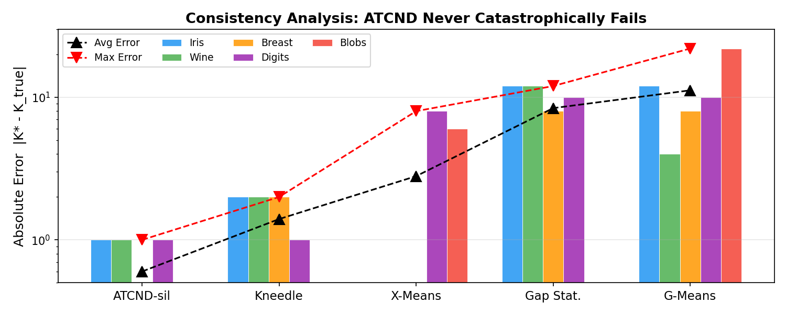
</p>

## Real-World Demos

### K-Means on Iris (3D)

<p align="center">
  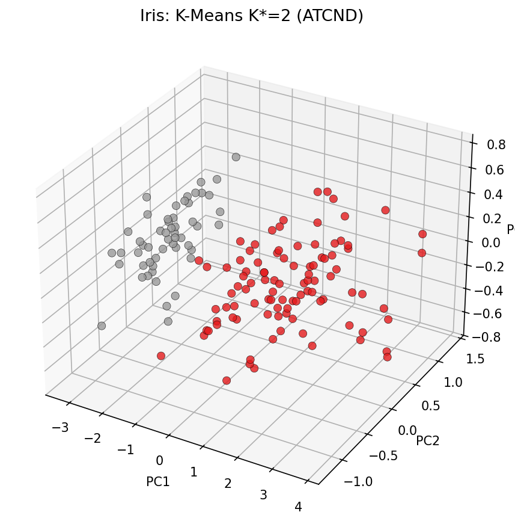
  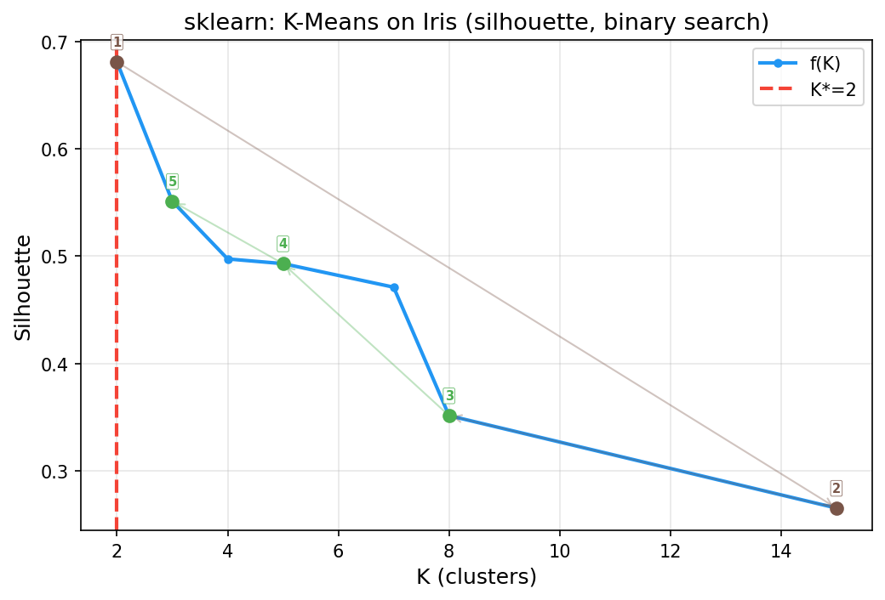
</p>

### GMM on Wine (3D)

<p align="center">
  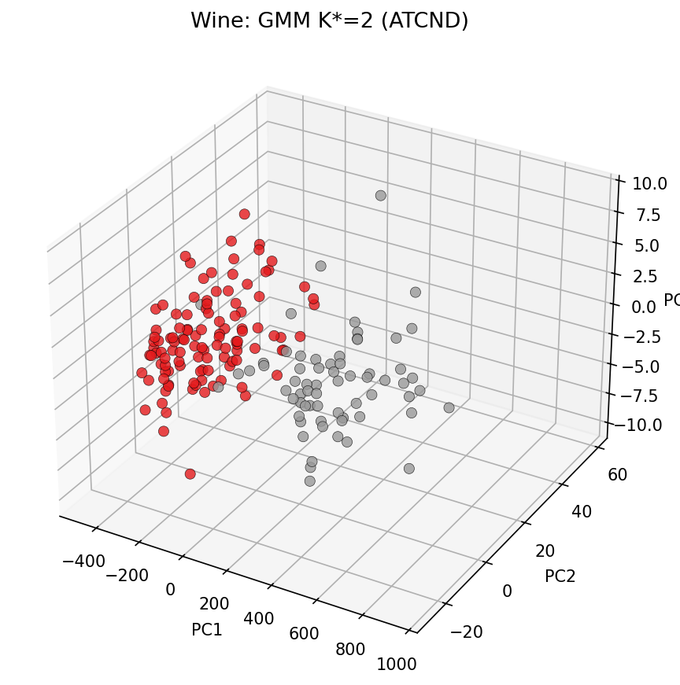
  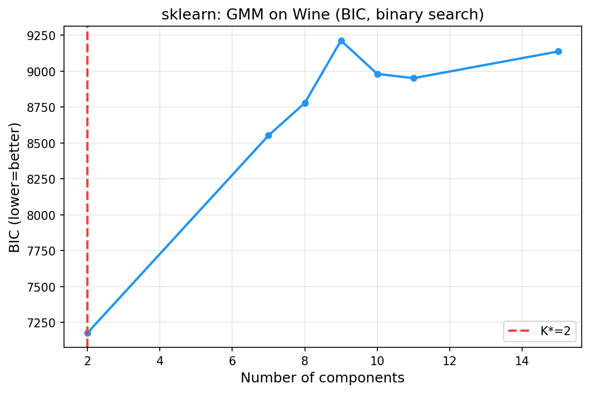
</p>

### PCA on Digits (3D)

<p align="center">
  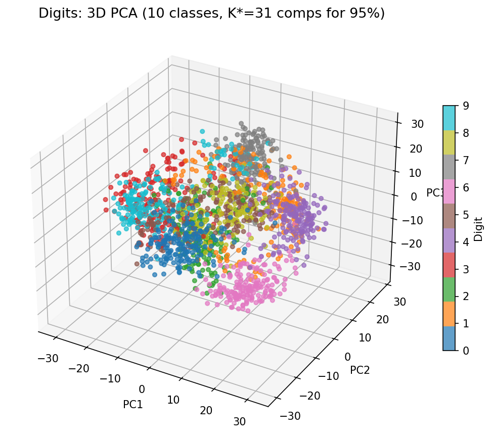
  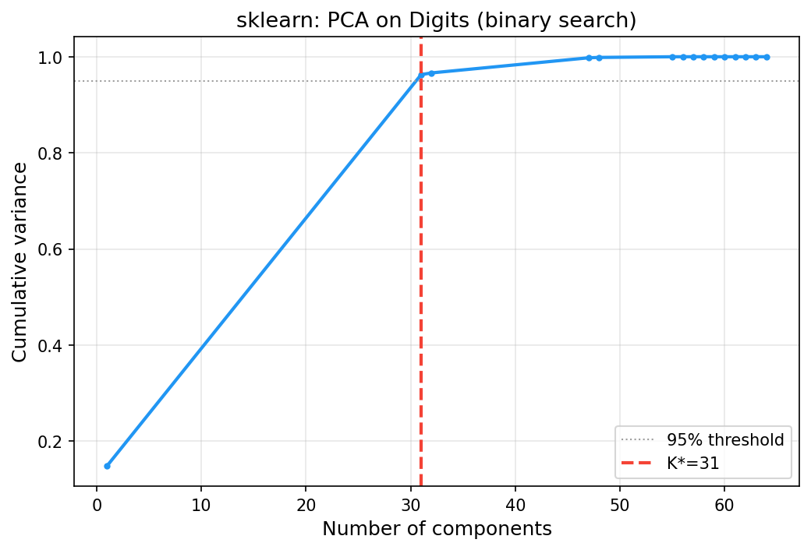
</p>

### DBSCAN on Two-Moons

<p align="center">
  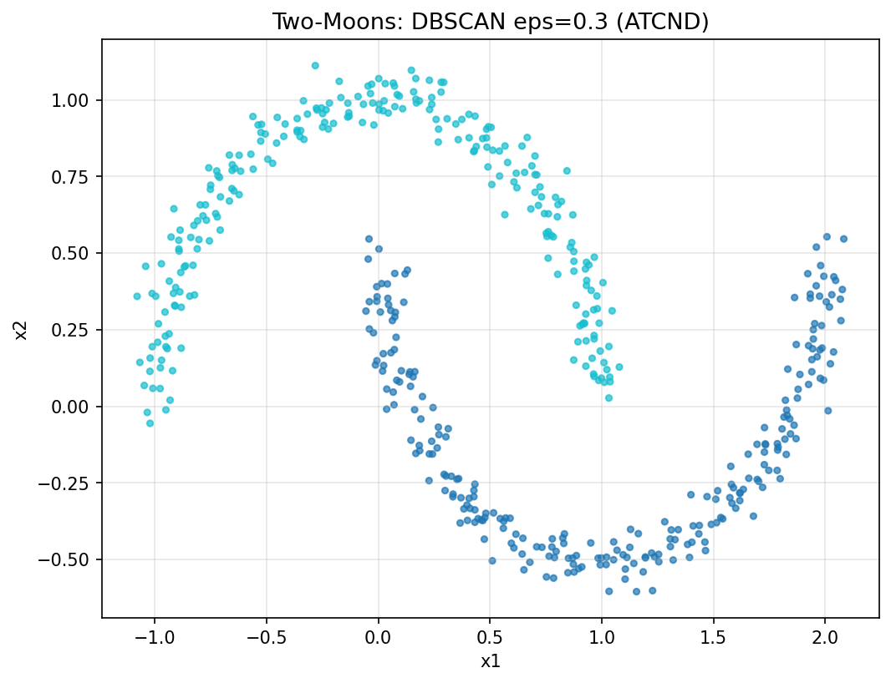
  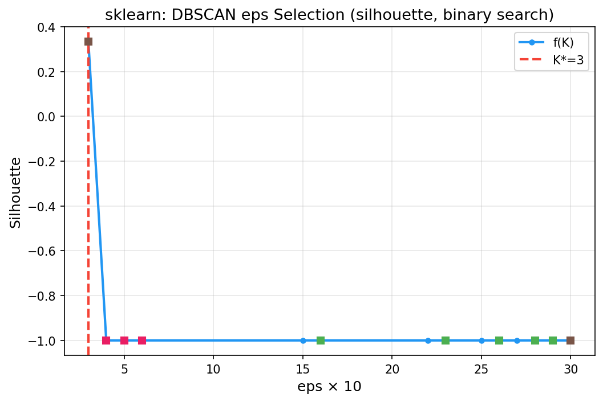
</p>

### Optimal Histogram Bins (AIC)

<p align="center">
  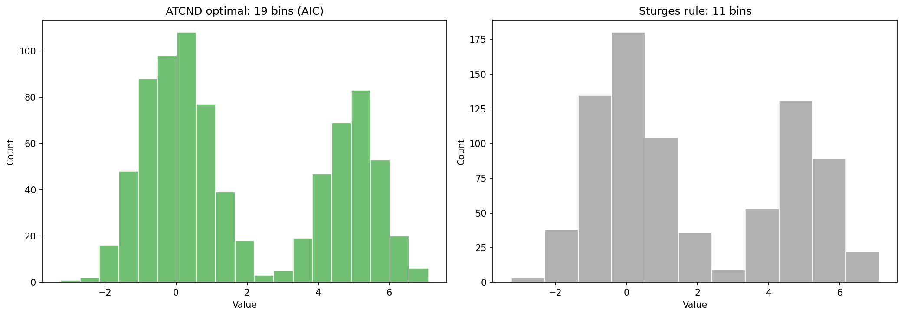
</p>

### Smoothing Spline (SciPy)

<p align="center">
  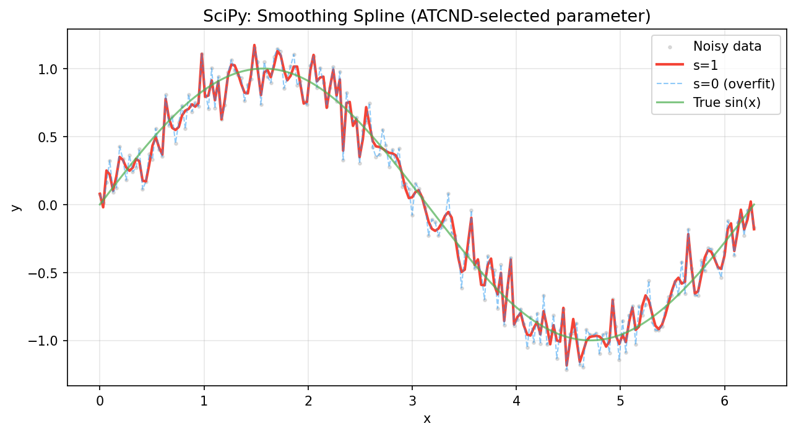
</p>

### Rolling Window (Pandas)

<p align="center">
  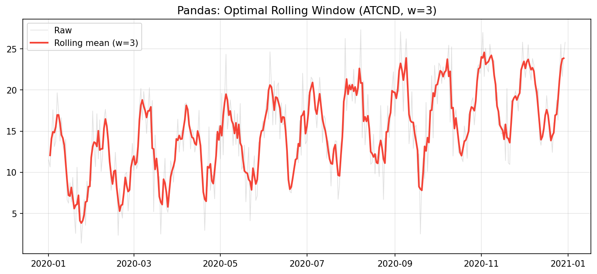
</p>

### NMF Topic Count (Gensim)

<p align="center">
  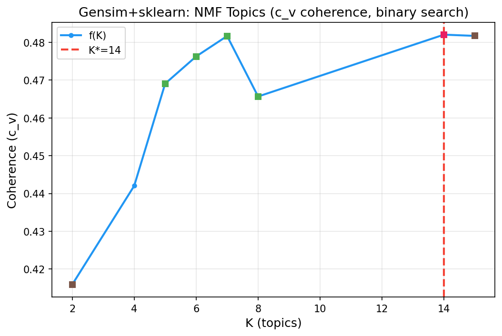
</p>

### PyTorch Hidden Layer Size

<p align="center">
  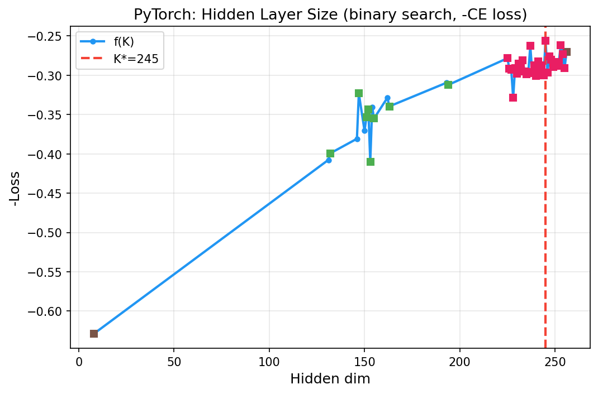
</p>

Run all demos with figures (SVG + PDF + PNG):

```bash
python examples/demo_all.py
# Output: examples/figures/*.{svg,pdf,png}
```

## Key Features

- **8 search strategies**: grid, binary, golden section, ternary, Fibonacci, interpolation, exponential, predictive
- **15 adapters** spanning NumPy, SciPy, scikit-learn, PyTorch, Gensim, and Pandas
- **3 model families**: LDA, NMF, K-Means (plus GMM, PCA, DBSCAN, etc.)
- **5 quality metrics**: silhouette, coherence (c_v), perplexity, reconstruction error, combined
- **Ranked candidate set**: returns multiple optimal K values (handles plateaus, ties, multi-optima)
- **First O(log N) method** in the model-agnostic + exact-K class: 59–79% fewer evaluations than grid search
- **Predictive search** with PCA hot-start: 76% reduction (7 evaluations vs 29 for grid)
- **CLI and Python API**

## Installation

```bash
pip install atcnd
```

For PyTorch adapters:

```bash
pip install atcnd[torch]
```

From source:

```bash
git clone https://github.com/CodeOfMe/ATCND.git
cd ATCND
pip install -e .
```

## Quick Start

### Python API

```python
from atcnd import ATCNDConfig, atcnd_search

# K-Means on numeric data
from sklearn.datasets import make_blobs
X, _ = make_blobs(n_samples=1000, n_features=50, centers=8, random_state=42)

config = ATCNDConfig(
    k_min=2, k_max=30,
    model_type="kmeans",
    search_strategy="binary",
    metric="silhouette",
    n_candidates=3,
)
result = atcnd_search(X=X, config=config)

print(f"Optimal K: {result.optimal_k}")
print(f"Best score: {result.optimal_score:.4f}")
print(f"Top candidates: {result.candidate_ks}")
print(f"Evaluations: {len(result.search_history)}")
```

### Low-level API (any callable)

```python
from atcnd import search
from sklearn.cluster import KMeans
from sklearn.metrics import silhouette_score

def f(k):
    km = KMeans(n_clusters=k, random_state=42, n_init=10)
    labels = km.fit_predict(X)
    return silhouette_score(X, labels)

result = search(f, k_min=2, k_max=30, strategy="binary")
print(f"K* = {result.optimal_k}, evals = {len(result.search_history)}")
```

### Adapter API (scikit-learn, PyTorch, Gensim, ...)

```python
from atcnd import search_model, search_gmm_components, search_nmf_topics
from sklearn.cluster import KMeans
from sklearn.mixture import GaussianMixture

# K-Means
r = search_model(KMeans, X, param_name="n_clusters", k_min=2, k_max=30, strategy="binary")

# GMM with BIC
r = search_gmm_components(X, k_min=2, k_max=15, strategy="binary")

# NMF topics with coherence
r = search_nmf_topics(texts, k_min=2, k_max=20, strategy="binary", metric="coherence")

# Predictive search with PCA hot-start
from atcnd import estimate_k_n_clusters
hot_k = estimate_k_n_clusters(X, k_min=2, k_max=30)
r = search(f, k_min=2, k_max=30, strategy="predictive", hot_start=hot_k)
```

### Text data (LDA/NMF)

```python
from atcnd import ATCNDConfig, atcnd_search

texts = ["your document texts here"] * 100

# NMF with coherence metric
config = ATCNDConfig(
    k_min=2, k_max=20,
    model_type="nmf",
    search_strategy="binary",
    metric="coherence",
)
result = atcnd_search(texts=texts, config=config)
```

### CLI

```bash
# Search with K-Means on synthetic data
atcnd search --model kmeans --strategy binary --k-min 2 --k-max 30

# Search with NMF
atcnd search --model nmf --strategy golden_section --metric silhouette

# JSON output
atcnd search --model kmeans --json

# Run benchmarks
atcnd benchmark --dataset blobs --k-min 2 --k-max 30

# All 8 strategies comparison
atcnd benchmark --dataset blobs --k-min 2 --k-max 30 --all-strategies
```

## Search Strategies Detail

### Predictive Search

Predictive search uses PCA-based hot-start to estimate K\* before any model evaluation, then applies parabolic peak fitting:

1. **PCA hot-start**: Eigenvalue elbow method estimates K\* from data structure
2. **Probing**: Evaluate f(K̂−1), f(K̂), f(K̂+1)
3. **Parabolic peak fitting**: Fit a parabola through the three best points and jump to the predicted peak
4. **Binary refinement**: Narrow the search around the predicted peak

```python
from atcnd import estimate_k_n_clusters, search

# PCA hot-start estimates K from eigenvalue elbow
hot_k = estimate_k_n_clusters(X, k_min=2, k_max=30)

# Predictive search uses hot_start to reduce evaluations
result = search(f, k_min=2, k_max=30, strategy="predictive", hot_start=hot_k)
```

### Fibonacci Search

Classical optimal algorithm for discrete unimodal search (Kiefer 1953). Achieves minimum worst-case evaluations among all derivative-free methods on unimodal functions.

### Exponential Search

Doubles the probe point (1, 2, 4, 8, ...) until f(K) decreases, then refines via binary search. Best when K\* is near K\_min.

## Adapters

15 adapters wrap common model/parameter pairs with appropriate quality metrics:

| Library | Adapter | Parameter | Metric |
|---------|---------|-----------|--------|
| sklearn | `search_model` | n\_clusters | silhouette |
| sklearn | `search_neighbors` | n\_neighbors | CV accuracy |
| NumPy | `search_bins` | bins | AIC |
| sklearn | `search_components` | n\_components | variance |
| SciPy | `search_knots` | internal knots | MSE |
| signal | `search_window` | window | BIC |
| any | `search_param` | any | user-defined |
| PyTorch | `search_hidden` | hidden\_dim | −CE |
| PyTorch | `search_layers` | n\_layers | −CE |
| sklearn | `search_trees` | n\_estimators | CV accuracy |
| sklearn | `search_dbscan_eps` | eps | silhouette |
| sklearn | `search_gmm_components` | n\_components | BIC |
| Pandas | `search_dataframe_bins` | bins | AIC |
| Pandas | `search_rolling_window` | window | BIC |
| Gensim | `search_nmf_topics` | n\_topics | c\_v coherence |

## Quality Metrics

| Metric | LDA | NMF | K-Means | Description |
|--------|-----|-----|---------|-------------|
| Silhouette | Yes | Yes | Yes | Inter-cluster separation vs intra-cluster cohesion |
| Coherence (c\_v) | Yes | Yes | No | Semantic coherence of top topic words |
| Perplexity | Yes | No | No | Negative log-likelihood per word |
| Reconstruction | No | Yes | Yes | Frobenius norm / inertia |
| Combined | Yes | Yes | No | 0.5 × silhouette + 0.5 × coherence |

## Multiple Optima

K is a discrete integer parameter. Multiple values of K may achieve the same or nearly the same quality score. ATCND returns `candidate_ks` (ranked list) alongside `optimal_k`, handling plateaus, ties, and multiple local maxima.

## Comparison with Baselines

ATCND is the first method in the model-agnostic + exact-K class to achieve O(log N) evaluations:

| Method | Model-agnostic? | Exact K\*? | Evals |
|--------|----------------|-----------|-------|
| **ATCND (all)** | **Yes** | **Yes** | **O(log N)** |
| Grid Search | Yes | Yes | O(N) |
| HDP | No (LDA only) | No | 1 (costly) |
| Top2Vec | No | No | 1 |
| Black-box Opt. | No (LDA only) | Yes | Variable |

### Real-World Results

| Dataset | Adapter | K\* | Strategy | Evals | Reduction |
|---------|---------|-----|----------|-------|-----------|
| Iris | search\_model | 2 | binary | 5 | 64% |
| Wine | search\_gmm | 2 | binary | 6 | 57% |
| Digits | search\_components | 31 | binary | 10 | 84% |
| Moons | search\_dbscan | 3 | binary | 10 | 64% |
| Wine | search\_trees | 300 | binary | 37 | 87% |
| Iris | search\_neighbors | 12 | binary | 9 | 70% |

## Development

```bash
# Install in development mode
pip install -e ".[dev]"

# Run tests (75 tests)
python -m pytest tests/ -v

# Format code
black src/atcnd/ tests/

# Lint code
ruff check src/atcnd/ tests/
```

## License

GNU General Public License v3.0 (GPLv3)